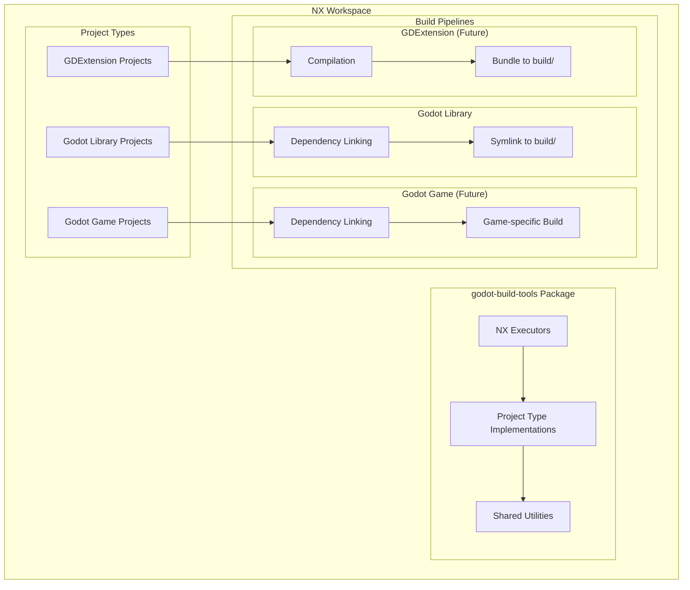

# Design Document

## Overview

The NX Godot Build System is a monorepo build toolchain that supports multiple project types within a Godot game development workspace. The system provides a plugin-based architecture similar to @nx/js, offering NX executors for building Godot projects and their dependencies, with extensibility for future GDExtension projects (C++/Rust) and Godot game projects.

The current implementation has several critical issues:
- Incorrect file references using relative paths instead of absolute package names
- Missing TypeScript type definitions and poor configuration
- Coupled pre-build and build steps
- Inconsistent workspace configuration

This design addresses these issues while creating a foundation for future extensibility, following the patterns established by @nx/js and other NX plugins.

## Architecture

### High-Level Architecture



### Package Structure

The build system follows the @nx/js pattern with these main components:

1. **Executors**: NX executors that can be referenced in project.json files (similar to @nx/js:tsc)
2. **Project Type Implementations**: Specific logic for different project types (Godot, GDExtension, etc.)
3. **Shared Utilities**: Common functionality for file operations, dependency resolution, etc.

The package structure mirrors @nx/js:
```
godot-build-tools/
├── src/
│   ├── executors/
│   │   ├── godot-library/      # For Godot library projects
│   │   ├── gdextension/        # Future: For GDExtension projects
│   │   ├── godot-game/         # Future: For Godot game projects
│   │   └── link-deps/          # Standalone dependency linking
│   ├── project-types/
│   └── utils/
├── executors.json
└── package.json
```

## Components and Interfaces

### Core Interfaces

```typescript
// Build step interface - generic step that can be chained
interface BuildStep {
  readonly name: string;
  execute(context: BuildContext): Promise<void>;
}

// Project type interface - defines the build pipeline for a project type
interface ProjectType {
  readonly name: string;
  createBuildPipeline(context: BuildContext): BuildStep[];
}

// Build context - information available to all build steps
interface BuildContext {
  readonly projectName: string;
  readonly projectRoot: string;
  readonly workspaceRoot: string;
  readonly buildDir: string; // Always {projectRoot}/build
  readonly dependencies: ProjectDependency[];
  readonly options: Record<string, any>; // Executor options
}

// Dependency information
interface ProjectDependency {
  readonly name: string;
  readonly buildDir: string; // Path to dependency's build/ folder
  readonly projectType: string;
}
```

### NX Executors

Following the @nx/js pattern, the system provides specialized executors:

1. **Godot Library Build Executor** (`godot-build-tools:godot-library`)
   - For Godot library projects only
   - Executes dependency linking followed by symlinking project files to build/
   - Creates both _addons/ and build/ directories

2. **GDExtension Build Executor** (`godot-build-tools:gdextension`)
   - For C++/Rust GDExtension projects (future)
   - Executes compilation followed by bundling
   - Creates build/ directory with compiled artifacts

3. **Dependency Link Executor** (`godot-build-tools:link-deps`)
   - Standalone executor for dependency linking
   - Used by Godot library and future Godot game projects
   - Can be used independently for IDE support (e.g., prepare step for games)
   - Creates _addons/ directory with dependency symlinks

Note: A future `godot-build-tools:godot-game` executor will handle Godot game projects with different build logic.

### Project Type Implementations

#### Godot Project Type

```typescript
class GodotProjectType implements ProjectType {
  readonly name = 'godot';
  
  createBuildPipeline(context: BuildContext): BuildStep[] {
    return [
      new DependencyLinkingStep(), // Links deps to _addons/
      new GodotSymlinkStep()       // Symlinks project files to build/
    ];
  }
}
```

#### GDExtension Project Type (Future)

```typescript
class GDExtensionProjectType implements ProjectType {
  readonly name = 'gdextension';
  
  createBuildPipeline(context: BuildContext): BuildStep[] {
    return [
      new CompilationStep(),  // Compiles C++/Rust code
      new BundlingStep()      // Bundles into GDExtension format in build/
    ];
  }
}
```

#### Godot Game Project Type (Future)

```typescript
class GodotGameProjectType implements ProjectType {
  readonly name = 'godot-game';
  
  createBuildPipeline(context: BuildContext): BuildStep[] {
    return [
      new DependencyLinkingStep(), // Same as Godot library
      new GameBuildStep()          // Different build logic for games
    ];
  }
}
```

## Data Models

### Project Configuration

Projects define their configuration in `project.json` using the appropriate executor:

```json
{
  "name": "example-godot-library",
  "projectType": "library",
  "targets": {
    "build": {
      "executor": "godot-build-tools:godot-library",
      "outputs": ["{projectRoot}/build", "{projectRoot}/_addons"]
    }
  }
}
```

For GDExtension projects (future):

```json
{
  "name": "example-gdextension-project",
  "projectType": "library",
  "targets": {
    "build": {
      "executor": "godot-build-tools:gdextension",
      "outputs": ["{projectRoot}/build"]
    }
  }
}
```

The executors will automatically handle dependency resolution and the `dependsOn` configuration internally by:
1. Reading the project's `implicitDependencies` from project.json
2. Ensuring dependency projects are built first
3. Using their build outputs for linking

This eliminates the need for manual `dependsOn` configuration in each project.

### Workspace Configuration

The workspace uses proper NX configuration. If absolute package references are not possible with local packages, we'll use the package name directly:

```json
{
  "npmScope": "godot",
  "plugins": ["godot-build-tools"],
  "workspaceLayout": {
    "appsDir": "",
    "libsDir": ""
  }
}
```

The godot-build-tools package will be properly configured with an executors.json file to register its executors with NX.

### TypeScript Configuration

Base TypeScript configuration enforces strict typing:

```json
{
  "compilerOptions": {
    "strict": true,
    "noImplicitAny": true,
    "noImplicitReturns": true,
    "noFallthroughCasesInSwitch": true,
    "noUncheckedIndexedAccess": true,
    "exactOptionalPropertyTypes": true
  }
}
```

## Error Handling

### Build Error Categories

1. **Configuration Errors**: Invalid project.json, missing dependencies
2. **File System Errors**: Permission issues, missing files
3. **Dependency Errors**: Circular dependencies, missing build artifacts
4. **Compilation Errors**: TypeScript compilation failures

### Error Handling Strategy

```typescript
class BuildError extends Error {
  constructor(
    message: string,
    public readonly category: ErrorCategory,
    public readonly projectName?: string,
    public readonly cause?: Error
  ) {
    super(message);
  }
}

enum ErrorCategory {
  CONFIGURATION = 'configuration',
  FILESYSTEM = 'filesystem',
  DEPENDENCY = 'dependency',
  COMPILATION = 'compilation'
}
```

### Recovery Mechanisms

- **Fail Fast**: Stop the build process immediately when any project fails to prevent inconsistent state
- **Retry Logic**: Retry file operations with exponential backoff for transient failures
- **Detailed Logging**: Provide actionable error messages with context and suggested fixes

## Testing Strategy

### Unit Testing

- **Core Interfaces**: Mock implementations for testing business logic
- **Utility Functions**: Test file operations, dependency resolution
- **Project Types**: Test build step creation and execution

### Integration Testing

- **End-to-End Builds**: Test complete build pipeline with sample projects
- **Dependency Resolution**: Test complex dependency graphs
- **Error Scenarios**: Test error handling and recovery

### Test Structure

```
godot-build-tools/
├── src/
│   ├── core/
│   ├── executors/
│   ├── project-types/
│   └── utils/
├── test/
│   ├── unit/
│   ├── integration/
│   └── fixtures/
└── e2e/
    └── sample-projects/
```

## Implementation Plan

### Phase 1: Core Infrastructure
1. Fix TypeScript configuration and add proper type definitions
2. Implement core interfaces and base classes
3. Create proper package structure with absolute imports

### Phase 2: Executor Implementation
1. Implement pre-build executor for dependency linking
2. Implement build executor for Godot projects
3. Create combined executor for convenience

### Phase 3: Project Integration
1. Update existing projects to use new executors
2. Fix workspace configuration and package references
3. Add comprehensive error handling

### Phase 4: Testing and Documentation
1. Implement unit and integration tests
2. Create comprehensive documentation
3. Add example projects and tutorials

### Phase 5: Future Extensibility
1. Design plugin system for new project types
2. Prepare architecture for GDExtension support
3. Implement caching and performance optimizations