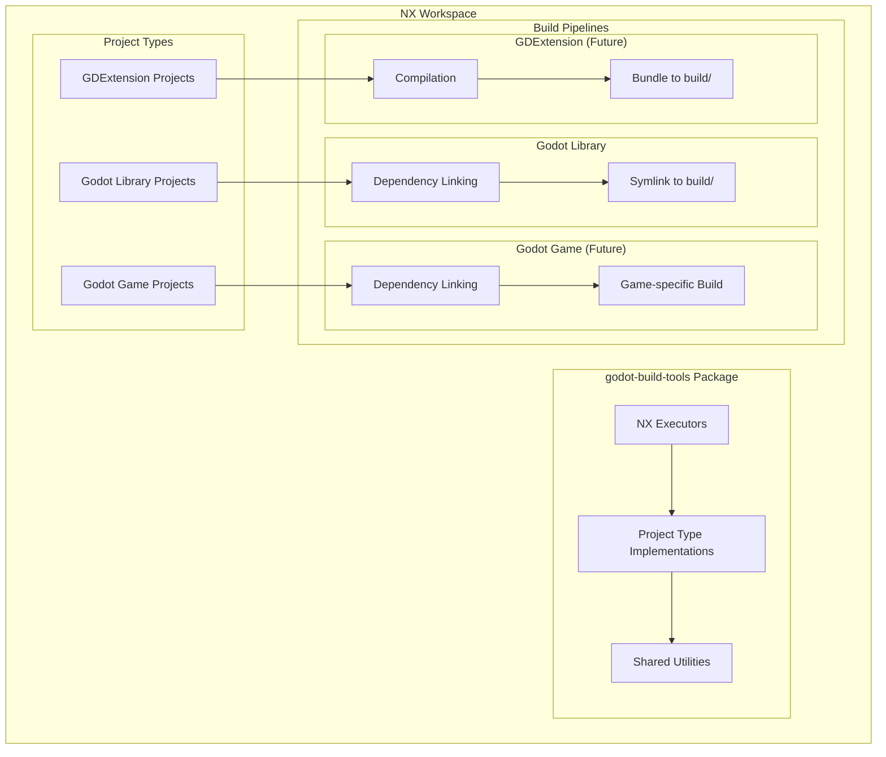
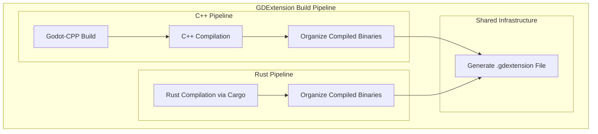

# Design Document

## Overview

The NX Godot Build System is a monorepo build toolchain that supports multiple project types within a Godot game development workspace. The system provides a plugin-based architecture similar to @nx/js, offering NX executors for building Godot projects and their dependencies, with extensibility for future GDExtension projects (C++/Rust) and Godot game projects.

The current implementation has several critical issues:
- Incorrect file references using relative paths instead of absolute package names
- Missing TypeScript type definitions and poor configuration
- Coupled pre-build and build steps
- Inconsistent workspace configuration

This design addresses these issues while creating a foundation for future extensibility, following the patterns established by @nx/js and other NX plugins.

## Architecture

### High-Level Architecture



### Package Structure

The build system follows the @nx/js pattern with these main components:

1. **Executors**: NX executors that can be referenced in project.json files (similar to @nx/js:tsc)
2. **Project Type Implementations**: Specific logic for different project types (Godot, GDExtension, etc.)
3. **Shared Utilities**: Common functionality for file operations, dependency resolution, etc.
4. **Build Steps**: Modular build steps that can be composed into build pipelines
5. **Compilation Infrastructure**: Shared compilation logic for C++ and Rust projects

The package structure mirrors @nx/js:
```
godot-build-tools/
├── src/
│   ├── executors/
│   │   ├── godot-library/      # For Godot library projects
│   │   ├── gdextension/        # For C++/Rust GDExtension projects
│   │   ├── gdextension-setup/  # IDE setup for GDExtension projects
│   │   ├── godot-game/         # Future: For Godot game projects
│   │   └── link-deps/          # Standalone dependency linking
│   ├── project-types/
│   │   ├── godot-project-type.ts
│   │   ├── cpp-gdextension-type.ts
│   │   └── rust-gdextension-type.ts
│   ├── build-steps/
│   │   ├── dependency-linking-step.ts
│   │   ├── godot-symlink-step.ts
│   │   ├── cpp-compilation-step.ts
│   │   ├── rust-compilation-step.ts
│   │   ├── gdextension-bundle-step.ts
│   │   └── godot-cpp-build-step.ts
│   ├── compilation/
│   │   ├── godot-cpp-manager.ts
│   │   ├── platform-config.ts
│   │   └── toolchain-detector.ts
│   └── utils/
├── executors.json
└── package.json
```

## GDExtension Architecture

### Compilation Infrastructure

The GDExtension build system provides shared infrastructure for compiling native code:



### Godot-CPP Management

For C++ projects, the system manages godot-cpp as a shared dependency:

```typescript
interface GodotCppManager {
  /**
   * Ensures godot-cpp is built for the specified version and platforms
   * Returns the path to the built godot-cpp artifacts
   */
  ensureGodotCpp(version: string, platforms: Platform[]): Promise<string>;
  
  /**
   * Gets the cached godot-cpp path if available
   */
  getCachedGodotCpp(version: string): string | null;
  
  /**
   * Cleans old godot-cpp builds to save disk space
   */
  cleanOldBuilds(): Promise<void>;
}
```

The godot-cpp builds are cached in a shared location (e.g., `tmp/godot-cpp-builds/`) and reused across projects.

### NX C++ Project Integration

Since NX doesn't have built-in C++ support, we'll create a general-purpose C++ project type that can be used independently or as dependencies for GDExtension projects:

```typescript
// Future: General NX C++ project type
class NxCppProjectType implements ProjectType {
  readonly name = 'nx-cpp';
  
  createBuildPipeline(context: BuildContext): BuildStep[] {
    return [
      new CppCompilationStep(),  // Uses SCons or CMake
      new CppLibraryBundleStep() // Creates static/dynamic libraries
    ];
  }
}
```

This allows for:
- **Standalone C++ libraries**: Regular C++ projects that can be consumed by other C++ projects
- **GDExtension dependencies**: C++ libraries that GDExtension projects can link against
- **Third-party integration**: Easy integration with external C++ libraries like Boost

### C++ Build System Integration

For C++ GDExtension projects, we'll use CMake as the build system. CMake is the most modern and widely adopted C++ build system, with excellent cross-platform support, toolchain detection, and IDE integration:

```typescript
interface CMakeWrapper {
  /**
   * Builds a C++ GDExtension project using CMake
   * CMake handles toolchain detection, cross-compilation, and platform-specific settings
   */
  buildProject(options: CppBuildOptions): Promise<void>;
}

interface CppBuildOptions {
  readonly projectRoot: string;
  readonly godotCppPath: string;
  readonly platforms: string[];        // e.g., ["windows.x86_64", "macos.universal", "linux.arm64"]
  readonly targets: string[];          // e.g., ["debug", "release", "editor"]
  readonly thirdPartyLibs?: string[];  // Additional C++ libraries
  readonly nxCppDependencies?: string[]; // Other NX C++ projects
}
```

This approach:
- **Modern build system**: CMake is the industry standard for C++ projects with excellent tooling support
- **Superior IDE integration**: CMake generates native IDE project files and compile_commands.json automatically
- **Excellent cross-compilation**: CMake has mature cross-compilation support with toolchain files
- **Package management**: CMake integrates well with vcpkg, Conan, and other C++ package managers
- **Widespread adoption**: Most C++ developers are familiar with CMake, making the system more accessible

### Platform and Architecture Configuration

Developers specify platforms using the intuitive format `platform.architecture`:

```typescript
interface PlatformTarget {
  readonly platform: string;      // "windows", "macos", "linux", "android", "ios", "web"
  readonly architecture: string;  // "x86_64", "arm64", "rv64", "wasm32", "universal"
  readonly target: string;        // "debug", "release", "editor"
}

// Platform specification examples:
// "windows.x86_64" -> Windows 64-bit Intel/AMD
// "macos.universal" -> macOS Universal Binary (x86_64 + arm64)
// "linux.arm64" -> Linux 64-bit ARM
// "android.arm64" -> Android 64-bit ARM
// "ios.universal" -> iOS Universal Framework
// "web.wasm32" -> WebAssembly 32-bit

// Internally converted to build system specific targets:
function parsePlatformTarget(platformSpec: string): PlatformTarget {
  const [platform, architecture] = platformSpec.split('.');
  return { platform, architecture, target: 'debug' }; // target added during build
}

// File naming follows Godot convention:
// lib{project}.{platform}.template_{target}.{arch}.{ext}
// e.g., "libexample.windows.template_release.x86_64.dll"
```

## Components and Interfaces

### Core Interfaces

```typescript
// Build step interface - generic step that can be chained
interface BuildStep {
  readonly name: string;
  execute(context: BuildContext): Promise<void>;
}

// Project type interface - defines the build pipeline for a project type
interface ProjectType {
  readonly name: string;
  createBuildPipeline(context: BuildContext): BuildStep[];
}

// Build context - information available to all build steps
interface BuildContext {
  readonly projectName: string;
  readonly projectRoot: string;
  readonly workspaceRoot: string;
  readonly buildDir: string; // Always {projectRoot}/build
  readonly dependencies: ProjectDependency[];
  readonly options: Record<string, any>; // Executor options
}

// Dependency information
interface ProjectDependency {
  readonly name: string;
  readonly buildDir: string; // Path to dependency's build/ folder
  readonly projectType: string;
}
```

### NX Executors

Following the @nx/js pattern, the system provides specialized executors:

1. **Godot Library Build Executor** (`godot-build-tools:godot-library`)
   - For Godot library projects only
   - Executes dependency linking followed by symlinking project files to build/
   - Creates both _addons/ and build/ directories

2. **GDExtension Build Executor** (`godot-build-tools:gdextension`)
   - For C++/Rust GDExtension projects
   - Auto-detects project type (C++ or Rust) based on project structure
   - Executes compilation followed by bundling
   - Creates build/ directory with compiled artifacts and .gdextension file

3. **GDExtension Setup Executor** (`godot-build-tools:gdextension-setup`)
   - Sets up IDE integration for C++ GDExtension projects only
   - Generates compile_commands.json and configures IDE hints for godot-cpp
   - Not needed for Rust projects (Cargo handles IDE integration automatically)
   - Can be run independently of the build process

4. **Dependency Link Executor** (`godot-build-tools:link-deps`)
   - Standalone executor for dependency linking
   - Used by Godot library and future Godot game projects
   - Can be used independently for IDE support (e.g., prepare step for games)
   - Creates _addons/ directory with dependency symlinks

Note: A future `godot-build-tools:godot-game` executor will handle Godot game projects with different build logic.

### Project Type Implementations

#### Godot Project Type

```typescript
class GodotProjectType implements ProjectType {
  readonly name = 'godot';
  
  createBuildPipeline(context: BuildContext): BuildStep[] {
    return [
      new DependencyLinkingStep(), // Links deps to _addons/
      new GodotSymlinkStep()       // Symlinks project files to build/
    ];
  }
}
```

#### C++ GDExtension Project Type

```typescript
class CppGDExtensionProjectType implements ProjectType {
  readonly name = 'cpp-gdextension';
  
  createBuildPipeline(context: BuildContext): BuildStep[] {
    return [
      new GodotCppBuildStep(),      // Builds godot-cpp if needed
      new CppCompilationStep(),     // Compiles C++ source files
      new GDExtensionBundleStep()   // Bundles into GDExtension format
    ];
  }
}
```

#### Rust GDExtension Project Type

```typescript
class RustGDExtensionProjectType implements ProjectType {
  readonly name = 'rust-gdextension';
  
  createBuildPipeline(context: BuildContext): BuildStep[] {
    return [
      new RustCompilationStep(),    // Compiles Rust source using Cargo
      new GDExtensionBundleStep()   // Bundles into GDExtension format
    ];
  }
}
```

#### Godot Game Project Type (Future)

```typescript
class GodotGameProjectType implements ProjectType {
  readonly name = 'godot-game';
  
  createBuildPipeline(context: BuildContext): BuildStep[] {
    return [
      new DependencyLinkingStep(), // Same as Godot library
      new GameBuildStep()          // Different build logic for games
    ];
  }
}
```

### GDExtension Bundling

The GDExtension bundling process creates the final artifacts that can be consumed by Godot projects:

```typescript
interface GDExtensionBundle {
  readonly projectName: string;
  readonly buildDir: string;
  readonly binaries: CompiledBinary[];
  readonly dependencies: GDExtensionDependency[];
  readonly config: GDExtensionConfig;
}

interface CompiledBinary {
  readonly platform: string;
  readonly buildType: 'debug' | 'release';
  readonly filePath: string;
  readonly fileName: string; // e.g., "libexample.windows.template_release.x86_64.dll"
}

interface GDExtensionConfig {
  readonly entrySymbol: string;
  readonly compatibilityMinimum: string;
  readonly reloadable: boolean;
}
```

The bundling process:

1. **Organize Compiled Binaries**: Move compiled libraries from tmp/ to build/bin/ with correct Godot naming convention
2. **Generate .gdextension File**: Create configuration file with library paths and metadata
3. **Handle Dependencies**: Include any dynamic dependencies in the dependencies section
4. **Clean Intermediate Files**: Remove tmp/ build files, keeping only final artifacts in build/

Example generated `.gdextension` file:

```ini
[configuration]
entry_symbol = "example_library_init"
compatibility_minimum = "4.4"
reloadable = true

[libraries]
macos.debug = "bin/libexample.macos.template_debug.framework"
macos.release = "bin/libexample.macos.template_release.framework"
windows.debug.x86_64 = "bin/libexample.windows.template_debug.x86_64.dll"
windows.release.x86_64 = "bin/libexample.windows.template_release.x86_64.dll"
linux.debug.x86_64 = "bin/libexample.linux.template_debug.x86_64.so"
linux.release.x86_64 = "bin/libexample.linux.template_release.x86_64.so"

[dependencies]
# Only included if dynamic dependencies exist
```

## Data Models

### Project Configuration

Projects define their configuration in `project.json` using the appropriate executor:

```json
{
  "name": "example-godot-library",
  "projectType": "library",
  "targets": {
    "build": {
      "executor": "godot-build-tools:godot-library",
      "outputs": ["{projectRoot}/build", "{projectRoot}/_addons"]
    }
  }
}
```

For C++ GDExtension projects:

```json
{
  "name": "example-cpp-gdextension",
  "projectType": "library",
  "targets": {
    "build": {
      "executor": "godot-build-tools:gdextension",
      "outputs": ["{projectRoot}/build"],
      "options": {
        "godotCppVersion": "4.4",
        "platforms": [
          "windows.x86_64",
          "windows.arm64", 
          "macos.universal",
          "linux.x86_64",
          "linux.arm64",
          "android.arm64",
          "ios.universal"
        ],
        "targets": ["debug", "release"],
        "linkType": "dynamic",
        "thirdPartyLibs": ["boost", "some-other-lib"],
        "nxCppDependencies": ["some-nx-cpp-project"]
      }
    },
    "setup": {
      "executor": "godot-build-tools:gdextension-setup"
    }
  }
}
```

For Rust GDExtension projects:

```json
{
  "name": "example-rust-gdextension",
  "projectType": "library",
  "targets": {
    "build": {
      "executor": "godot-build-tools:gdextension",
      "outputs": ["{projectRoot}/build"],
      "options": {
        "platforms": [
          "windows.x86_64",
          "macos.universal", 
          "linux.x86_64",
          "linux.arm64",
          "web.wasm32"
        ],
        "targets": ["debug", "release"],
        "compatibilityMinimum": "4.1",
        "reloadable": true
      }
    }
  }
}
```

The executors will automatically handle dependency resolution and the `dependsOn` configuration internally by:
1. Reading the project's `implicitDependencies` from project.json
2. Ensuring dependency projects are built first
3. Using their build outputs for linking

This eliminates the need for manual `dependsOn` configuration in each project.

### Workspace Configuration

The workspace uses proper NX configuration. If absolute package references are not possible with local packages, we'll use the package name directly:

```json
{
  "npmScope": "godot",
  "plugins": ["godot-build-tools"],
  "workspaceLayout": {
    "appsDir": "",
    "libsDir": ""
  }
}
```

The godot-build-tools package will be properly configured with an executors.json file to register its executors with NX.

### TypeScript Configuration

Base TypeScript configuration enforces strict typing:

```json
{
  "compilerOptions": {
    "strict": true,
    "noImplicitAny": true,
    "noImplicitReturns": true,
    "noFallthroughCasesInSwitch": true,
    "noUncheckedIndexedAccess": true,
    "exactOptionalPropertyTypes": true
  }
}
```

## Error Handling

### Build Error Categories

1. **Configuration Errors**: Invalid project.json, missing dependencies
2. **File System Errors**: Permission issues, missing files
3. **Dependency Errors**: Circular dependencies, missing build artifacts
4. **Compilation Errors**: TypeScript compilation failures

### Error Handling Strategy

```typescript
class BuildError extends Error {
  constructor(
    message: string,
    public readonly category: ErrorCategory,
    public readonly projectName?: string,
    public readonly cause?: Error
  ) {
    super(message);
  }
}

enum ErrorCategory {
  CONFIGURATION = 'configuration',
  FILESYSTEM = 'filesystem',
  DEPENDENCY = 'dependency',
  COMPILATION = 'compilation'
}
```

### Recovery Mechanisms

- **Fail Fast**: Stop the build process immediately when any project fails to prevent inconsistent state
- **Retry Logic**: Retry file operations with exponential backoff for transient failures
- **Detailed Logging**: Provide actionable error messages with context and suggested fixes

## Testing Strategy

### Unit Testing

- **Core Interfaces**: Mock implementations for testing business logic
- **Utility Functions**: Test file operations, dependency resolution
- **Project Types**: Test build step creation and execution

### Integration Testing

- **End-to-End Builds**: Test complete build pipeline with sample projects
- **Dependency Resolution**: Test complex dependency graphs
- **Error Scenarios**: Test error handling and recovery

### Test Structure

```
godot-build-tools/
├── src/
│   ├── core/
│   ├── executors/
│   ├── project-types/
│   └── utils/
├── test/
│   ├── unit/
│   ├── integration/
│   └── fixtures/
└── e2e/
    └── sample-projects/
```

## Implementation Plan

### Phase 1: Core Infrastructure
1. Fix TypeScript configuration and add proper type definitions
2. Implement core interfaces and base classes
3. Create proper package structure with absolute imports

### Phase 2: Executor Implementation
1. Implement pre-build executor for dependency linking
2. Implement build executor for Godot projects
3. Create combined executor for convenience

### Phase 3: Project Integration
1. Update existing projects to use new executors
2. Fix workspace configuration and package references
3. Add comprehensive error handling

### Phase 4: Testing and Documentation
1. Implement unit and integration tests
2. Create comprehensive documentation
3. Add example projects and tutorials

### Phase 5: C++ Project Foundation
1. Design general-purpose NX C++ project type for standalone libraries using CMake
2. Implement CMake wrapper with cross-platform support and toolchain detection
3. Add third-party C++ library integration (vcpkg, Conan, system packages)
4. Create IDE setup executor that generates CMake project files and compile_commands.json

### Phase 6: GDExtension Implementation
1. Implement GDExtension project type detection (C++ vs Rust based on file structure)
2. Create godot-cpp management system with CMake integration and caching
3. Implement C++ GDExtension compilation pipeline extending the general C++ project type
4. Implement Rust compilation pipeline using Cargo with cross-compilation targets
5. Create shared binary organization and .gdextension file generation system
6. Add support for multiple build targets (debug/release) by default

### Phase 7: Integration and Testing
1. Update sample projects to use GDExtension dependencies
2. Test multi-platform, multi-architecture, multi-target builds
3. Validate CMake integration and godot-cpp caching
4. Optimize build performance and NX caching integration